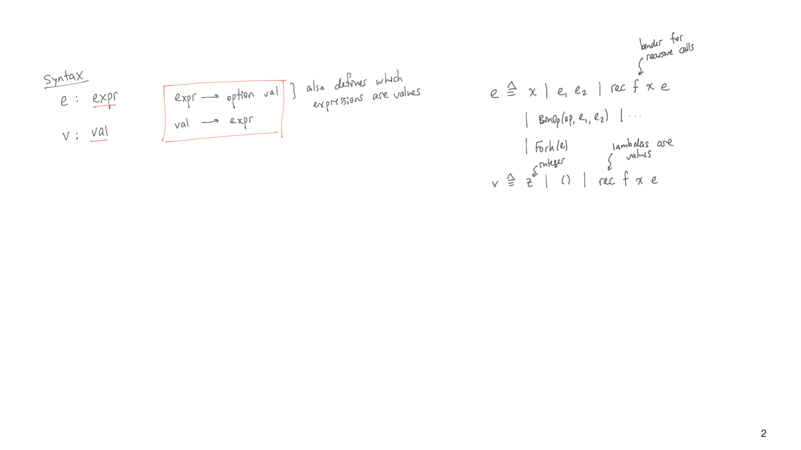
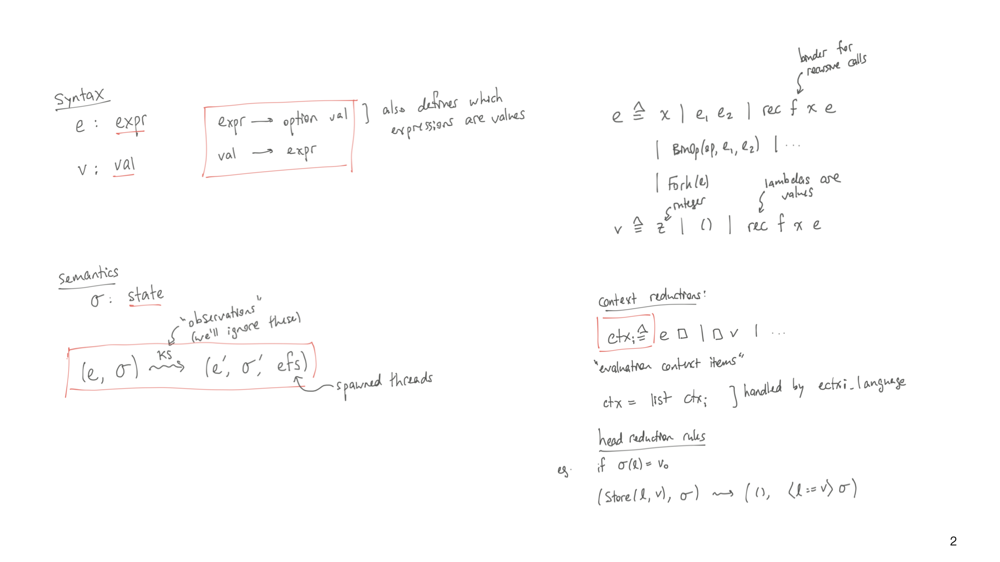
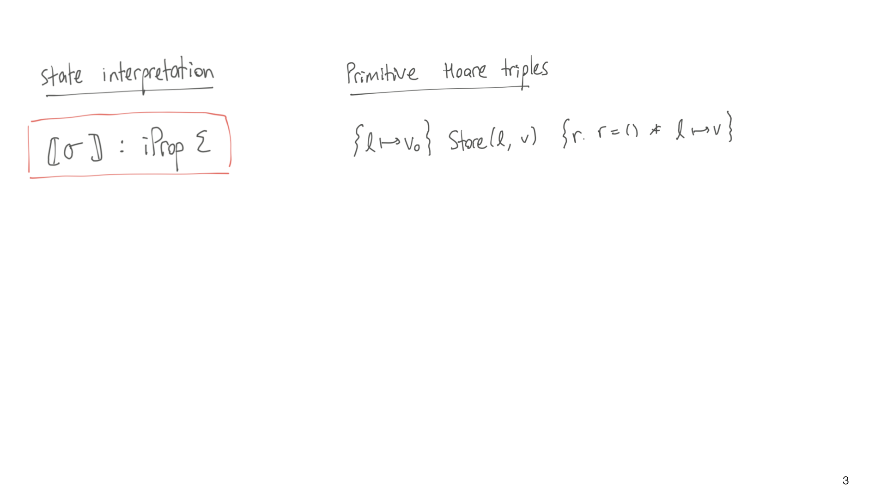
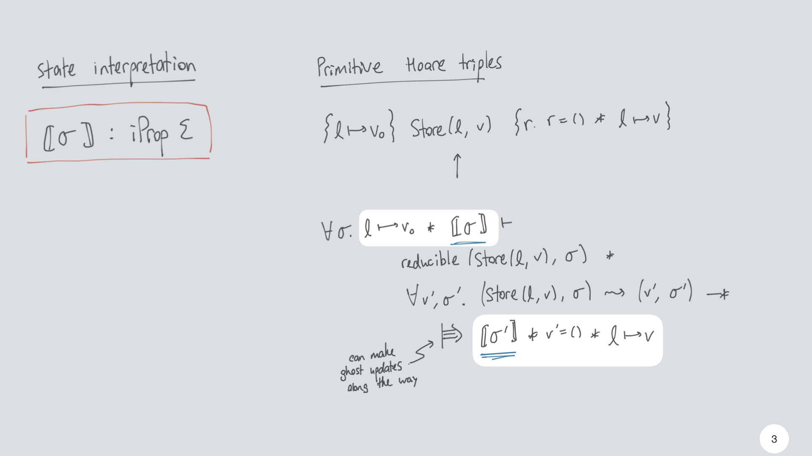
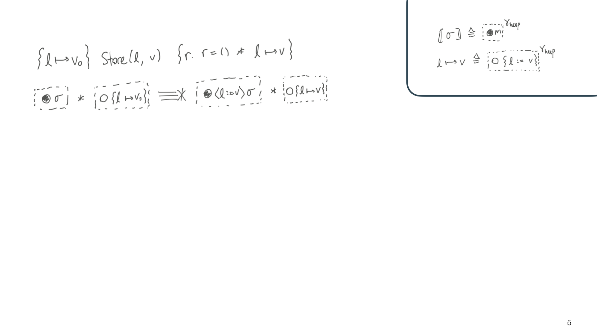
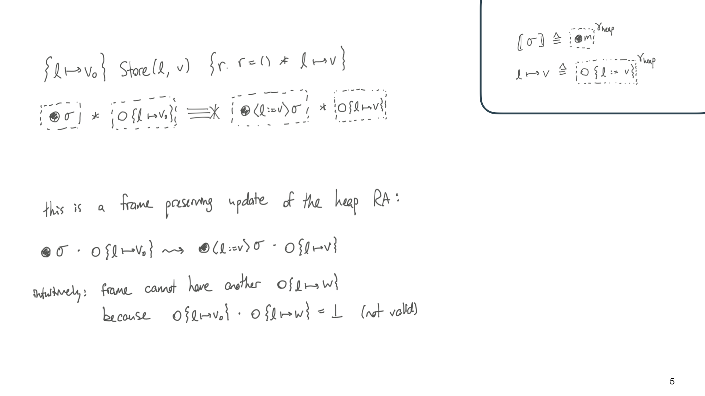

# Instantiating Iris - a conceptual overview

(this is a static version of a 12-minute overview I recorded which you can
watch on [YouTube](https://youtu.be/HndwyM04KEU))

We're going to instantiate Iris with a new language. What that means is we'll
define a language - a syntax and semantics - and then use Iris's general
definition of weakest preconditions to get a program logic for our language.

First, we need a syntax for the language. This works best with a lambda calculus
because it is expected to be defined in terms of a type of expressions and a
type of values, with functions `to_val` and `of_val` to go back and forth.
`to_val : expr -> option val` is partial and when it returns Some we think of
that expression as a value. This will be relevant later when thinking about when
programs are done executing vs stuck.

The `simp_lang` language has the standard lambda calculus constructs for
variables and lambdas, some pure and heap operations, and `Fork` for
concurrency.

Next we need a semantics. This is a stateful language so we define a type of
state; `simp_lang` is simple enough that the only state is a heap from locations
to values. The semantics is expressed in standard lambda calculus fashion as a
transition relation between a starting expression and state `(e, σ)` and a next
expression and state `(e', σ')`. We can also spawn threads along the way with
`Fork` which the semantics can interleave non-deterministically.

Writing down this complete relation is a bit of work so Iris comes up with a
simpler interface built on top of the general language interface. This
interface, `ectxi_language`, allows you to describe the semantics using
_evaluation context items_ that define which subexpression to evaluate, combined
with _head reduction rules_ that describe how to finally reduce each construct
in the language. As a simple example, `e □` and `□ v` are contexts that say we
can reduce the argument to an application at any time and the function in an
application once its argument is a value. This defines a deterministic
right-to-left evaluation order.

Now we want to take our language and plug it into Iris. What we need to finish
the definition of weakest preconditions is something called a state
interpretation, which maps states of the language to some sort of ownership
within the Iris logic. To illustrate what the state interpretation does, I'll
walk through how it appears in the definition of weakest preconditions.

Now the complete definition of `wp` is a bit hairy and abstract, so I'll walk
through what it boils down to for a simple Hoare spec about a language
primitive, `Store(l, v)` (which we typically write with notation as `l <- v`).
We can prove this triple in a low-level way by proving this Iris entailment:

If we look at the beginning and end of this entailment, we can see that it
_assumes_ the precondition and state interpretation (at `σ`) hold initially and
has to _prove_ the state interpretation (at `σ'`) and postcondition hold at the
end. This works out only because `Store` is atomic - the definition of weakest
preconditions sort of threads the state interpretation through as an invariant,
albeit one which is tied to some evolving state of the program.

In between we prove that `Store(l, v)` is reducible - this is what guarantees
that any weakest precondition implies the expression doesn't get stuck - and we
get to assume that `Store` takes a step and prove the state interpretation of
the new state. Finally, the `|==>` is a _fancy update_ modality that allows us
to update ghost state before proving the new state interpretation. We'll need
that because the state interpretation asserts ownership of some ghost state, and
we need to update it to match the new state `σ'`.

So what is the state interpretation? It's basically ownership of a particular
RA, the auth RA for maps. If you have seen this RA, the state intepretation for
a heap-based language has the auth element of this RA while the definition of
points-to `l ↦ v` holds fragments.

If you haven't seen it, here's a quick overview of the simplest RA that would
work for the heap. We have two types of elements in the carrier - authoritative
elements `●m` that intuitively will hold the entire heap `m` and fragments `◯m`
that will hold portions of the heap. Fragments compose by disjoint union (while
fragments that overlap compose to some invalid element), and we can have a
single authoritative element and any number of fragments. Crucially this RA
maintains a connection between the auth and its fragments: each fragment is
always a subset of the entire auth.

Now going back to the state interpretation and points-to definition we can see
why the definition of points-to has meaning: it asserts _knowledge_ of what's in
the heap because of validity (when combined with the state interpretation), and
it asserts _exclusive ownership_ because no other thread can have the same
fragment since the composition is invalid.

This is the most basic RA where threads always have all-or-nothing access to a
location - we can build a more sophisticated RA that also supports fractional
permissions, and indeed that's what the code does.

Now we can go back and understand how to use the state interpretation to prove a
primitive Hoare triple. These are needed to finish a language instantiation;
after all the primitives have specs the user can use the program logic to prove
larger programs, but we need to use lower-level tools to prove the primitives
correct.

If we simplify this example down to what `Store` specifically needs (due to its
particular execution semantics), and take care of proving that `Store` is
reducible if we have `l ↦ v0`, the task remaining is just a particular
viewshift. We need to take the combination of state interpretation and
precondition ownership to a new state interpretation and postcondition points-to fact.

Turns out this is just a frame-preserving update in the heap RA. Intuitively
this works for the same reason `l ↦ v` is exclusive: the frame cannot also have
`l ↦ w` because then the combination of the frame with this thread's ownership
would be invalid.

In summary:

